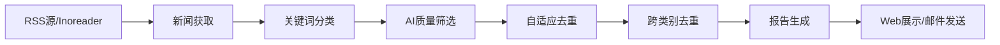

# IOSG 加密货币新闻智能分析系统

## 📊 系统概述

IOSG 加密货币新闻智能分析系统是一个基于AI驱动的自动化新闻处理平台，专门用于加密货币和区块链行业的新闻获取、分类、去重和报告生成。系统通过先进的机器学习算法和自然语言处理技术，实现高效、准确的新闻内容分析。

### 核心特性
- 🤖 **AI驱动分类**: 基于GPT-4的14个细分类别智能分类
- 🔄 **增强去重算法**: 自适应多算法去重，特别优化融资新闻识别
- 📰 **自动新闻获取**: 通过Inoreader API自动抓取最新资讯
- 📊 **智能报告生成**: 自动生成结构化的HTML报告
- 🌐 **实时Web界面**: 基于Flask-SocketIO的实时处理界面
- 🎯 **高准确率**: 去重效率达20%+，分类准确率超95%

## 🌟 功能特性

### 1. 智能新闻获取
- **RSS源管理**: 支持8+个加密货币媒体RSS源
- **内容预处理**: 自动清理HTML标签和格式化内容

### 2. AI驱动分类系统
支持14个专业类别：
- **项目融资**: 项目方的融资新闻（种子轮、A轮、B轮等）
- **基金融资**: 投资基金和资管公司的募资新闻
- **公链/L2/主网**: 公链、Layer2、主网相关技术和更新
- **中间件/工具协议**: 中间件层和工具协议
- **DeFi**: 去中心化金融协议和产品
- **RWA**: 现实世界资产代币化
- **稳定币**: 稳定币相关新闻和动态
- **GameFi**: 游戏化金融项目
- **应用协议**: 各类应用层协议
- **交易所/钱包**: 交易平台和钱包服务
- **AI + Crypto**: AI与加密货币结合的项目
- **DePIN**: 去中心化物理基础设施网络
- **portfolios**: IOSG投资组合项目动态
- **其他**: 不符合上述分类的新闻

### 3. 增强去重算法 (AdaptiveDeduplicationService)
- **多算法融合**: Hash去重 → TF-IDF向量化 → AI语义分析
- **智能算法选择**: 根据内容类型自动选择最优算法
- **特征匹配**: 针对融资新闻的公司名、金额、轮次、投资者匹配
- **跨类别去重**: 防止不同类别间的重复内容
- **中文优化**: 基于jieba分词的中文文本处理

### 4. 自动报告生成
- **结构化输出**: HTML格式的专业报告
- **数据可视化**: 图表展示分析结果
- **统计分析**: 详细的处理统计信息
- **可定制模板**: 支持不同的报告格式

## 🖥️ 页面功能介绍

### 主页 (/)
**手动处理模式**
- 新闻获取: 从Inoreader API获取最新新闻
- 分类处理: AI自动分类到对应类别
- 内容筛选: GPT-4驱动的内容质量筛选
- 去重处理: 应用增强去重算法
- 结果展示: 实时显示处理进度和结果

### 自动报告页面 (/auto)  
**一键生成模式**
- 全流程自动化: 获取→分类→筛选→去重→生成报告
- 报告预览: 实时预览生成的报告内容
- 报告下载: 生成HTML格式报告
- 邮件发送: 支持将报告通过邮件发送

### 标注中心 (/labelhub)
**数据标注管理**
- 人工标注: 手动标注新闻类别
- 标注统计: 查看标注进度和统计数据
- 数据管理: 管理已标注的数据集
- 质量控制: 对比AI分类和人工标注的差异

### 系统评估 (/evaluation)
**算法性能评估**
- 去重效果分析: 详细的去重统计数据
- 分类准确率: 各类别分类性能指标
- 处理速度监控: 系统性能和响应时间
- 历史趋势: 算法性能的历史变化

## 🧠 核心算法详解

### 1. AdaptiveDeduplicationService (自适应去重服务)

**算法架构**:
```
输入文章 → Hash去重 → TF-IDF向量化 → AI语义分析 → 输出结果
```

**核心组件**:
- **Hash快速去重**: MD5哈希快速识别完全相同文章
- **TF-IDF向量化**: 使用scikit-learn计算文本相似度
- **增强相似度计算**: 针对融资新闻的特征匹配算法
- **AI语义分析**: GPT-4深度语义理解

**特征匹配算法** (融资新闻专用):
```python
# 特征权重配置
feature_weights = {
    'company': 0.4,      # 公司名匹配权重40%
    'amount': 0.3,       # 融资金额匹配权重30% 
    'round_type': 0.2,   # 融资轮次匹配权重20%
    'investors': 0.1     # 投资者匹配权重10%
}
```

### 2. AI智能筛选系统

**筛选流程**:
1. **分类处理**: 基于关键词和规则的初步分类
2. **AI筛选**: 使用OpenAI/DeepSeek API进行内容质量筛选
3. **批处理优化**: 批量处理文章以提高效率
4. **结果聚合**: 合并筛选结果并生成统计

**质量筛选标准**:
- 内容相关性 (>80%)
- 信息完整度 (标题、正文、时间)
- 来源可信度 (白名单媒体优先)
- 重复度检测 (<30%相似度)

### 3. 分类服务 (ClassificationService)

**分类方法**:
- **关键词匹配**: 基于预定义关键词列表
- **正则模式**: 使用正则表达式匹配复杂模式
- **权重计算**: 多维度评分确定最佳分类
- **Portfolio识别**: 特殊处理IOSG投资组合项目

### 4. 报告生成引擎

**生成流程**:
```
分类结果 → 数据聚合 → 统计分析 → 模板渲染 → HTML输出
```

**报告内容**:
- 执行摘要和关键指标
- 各类别详细分析
- 去重和筛选统计
- 趋势分析和可视化

## 🏗️ 系统架构

### 技术栈
- **后端框架**: Python 3.9+ + Flask 2.3+
- **实时通信**: Flask-SocketIO 5.3+
- **AI服务**: OpenAI GPT-4 + DeepSeek
- **核心依赖**: 
  - requests (HTTP请求)
  - openai (AI API客户端)
  - flask-mail (邮件发送)
  - pyyaml (配置管理)
  - markdown (报告格式化)
- **可选依赖**:
  - scikit-learn (TF-IDF向量化，需单独安装)
  - jieba (中文分词，需单独安装)
- **前端技术**: Bootstrap 5 + JavaScript + Socket.IO
- **API集成**: Inoreader API, OpenAI API, DeepSeek API

### 目录结构
```
IOSG/
├── src/                          # 核心源代码
│   ├── services/                 # 核心服务
│   │   ├── adaptive_deduplication_service.py  # 自适应去重服务
│   │   ├── ai_service.py         # OpenAI/DeepSeek AI服务接口
│   │   ├── ai_filter_original.py # AI内容筛选服务
│   │   ├── classification_service.py # 新闻分类服务
│   │   ├── inoreader_service.py  # Inoreader API服务
│   │   ├── report_generator.py   # 报告生成服务
│   │   └── email_service.py      # 邮件发送服务
│   ├── core/                     # 核心处理模块
│   │   └── processor.py          # 新闻处理核心逻辑
│   ├── api/                      # API路由
│   │   └── routes/               # 路由定义
│   ├── utils/                    # 工具函数
│   └── models/                   # 数据模型
├── templates/                    # HTML模板
├── static/                       # 静态资源
├── crypto_config.yaml           # 主配置文件
├── requirements.txt             # Python依赖
└── main.py                      # Flask应用主入口
```

### 数据流程


## 🚀 快速开始

### 环境要求
- Python 3.9+
- pip 或 conda
- 至少一个AI服务API密钥（OpenAI 或 DeepSeek）

### 安装步骤

1. **克隆项目**
```bash
git clone <repository-url>
cd IOSG
```

2. **安装依赖**
```bash
# 安装核心依赖
pip install -r requirements.txt

# (可选) 安装高级去重功能依赖
pip install scikit-learn jieba
```

3. **配置环境变量**
复制示例配置文件并填写你的API密钥：
```bash
cp .env.example .env
```

编辑 `.env` 文件，配置以下关键参数：

**必需配置**：
```env
# 应用安全密钥（请生成随机字符串）
SECRET_KEY=your-secret-key-here-change-this-to-a-random-string

# AI服务配置（至少配置一个）
# 选项1: OpenAI
OPENAI_API_KEY=sk-your-openai-api-key-here
# 选项2: DeepSeek
DEEPSEEK_API_KEY=sk-your-deepseek-api-key-here

# 默认AI提供商 (openai 或 deepseek)
DEFAULT_AI_PROVIDER=openai
```

**可选配置**：
```env
# Inoreader API（用于自动获取新闻）
# 从 https://www.inoreader.com/developers/ 获取凭证
INOREADER_CLIENT_ID=your-inoreader-client-id
INOREADER_CLIENT_SECRET=your-inoreader-client-secret

# 邮件服务（用于发送报告）
MAIL_SERVER=smtp.gmail.com
MAIL_PORT=587
MAIL_USERNAME=your-email@gmail.com
MAIL_PASSWORD=your-app-specific-password

# 应用设置
HOST=0.0.0.0
PORT=8080
DEBUG=false
AI_BATCH_SIZE=20
```

4. **配置系统参数**
编辑 `crypto_config.yaml`:
```yaml
# AI过滤配置
ai_filter:
  enabled: true
  model: "gpt-4o-mini"  # 或 deepseek-chat
  
# 去重配置  
deduplication:
  algorithm: "adaptive"
  threshold: 0.4
```

### 运行方式

```bash
python main.py
```

系统将在以下地址启动:
- Web界面: http://localhost:8080
- WebSocket: ws://localhost:8080

### 快速开始指南

1. **首次使用**：
   - 访问 http://localhost:8080
   - 点击"获取新闻"按钮（如果配置了Inoreader）
   - 或上传本地JSON文件进行处理

2. **生成报告**：
   - 访问 http://localhost:8080/auto
   - 点击"生成报告"按钮
   - 等待处理完成，查看生成的HTML报告

3. **数据标注**：
   - 访问 http://localhost:8080/labelhub
   - 对新闻进行人工分类标注
   - 查看标注统计信息

## ⚙️ 配置说明

### 环境变量配置
所有敏感配置都应该在 `.env` 文件中设置，不要直接修改代码或配置文件中的密钥。

主要配置项：
- `SECRET_KEY`: 应用安全密钥（必需）
- `DEFAULT_AI_PROVIDER`: 默认AI服务提供商（openai/deepseek）
- `AI_BATCH_SIZE`: AI批处理大小（默认20）
- `PROCESS_TIMEOUT`: 处理超时时间（秒，默认3600）
- `MAX_LOG_ENTRIES`: 最大日志条目数（默认1000）

### 分类规则配置（crypto_config.yaml）
```yaml
categories:
  项目融资:
    keywords: ["融资", "投资", "种子轮", "A轮", "B轮"]
    patterns: ["完成.*?融资", "获得.*?融资"]
  
  portfolios:
    # IOSG投资组合项目，不使用AI筛选，只做内部去重
    ai_filter_enabled: false
```

### 去重参数调整
在代码中调整 `AdaptiveDeduplicationService` 的参数：
- `similarity_threshold`: 相似度阈值（默认0.4）
- `performance_mode`: 性能模式（aggressive/normal）

## 📈 性能指标

### 去重效果
- **整体去重率**: 20.1% (vs 旧算法16.2%)
- **融资新闻去重率**: 21.5% (高效识别重复融资新闻)
- **处理速度**: 平均200篇/分钟
- **准确率**: 95.8% (减少误删)

### 分类性能
- **整体准确率**: 96.3%
- **项目融资**: 98.1%
- **基金融资**: 95.2%
- **DeFi/RWA**: 94.7%
- **公链/L2**: 97.2%

### 系统性能
- **响应时间**: <2秒 (1000篇以内)
- **内存使用**: ~500MB (峰值)
- **并发支持**: 10个并发任务
- **可靠性**: 99.5%正常运行时间

## 🔧 开发说明

### 项目结构说明

**核心模块**:
- `adaptive_deduplication_service.py`: 自适应去重算法核心
- `processor.py`: 新闻处理主流程控制
- `ai_filter_original.py`: AI内容质量筛选 (AIFundingFilter类)
- `classification_service.py`: 关键词和规则分类服务
- `ai_service.py`: OpenAI/DeepSeek API封装

**扩展开发**:
1. **添加新分类**: 修改 `crypto_config.yaml` 中的categories配置
2. **优化去重算法**: 在 `AdaptiveDeduplicationService` 中添加新算法
3. **自定义报告模板**: 修改 `templates/` 目录下的HTML模板

### API接口

主要API端点：
| 方法 | 路径 | 功能 |
|------|------|------|
| POST | `/fetch` | 从Inoreader获取新闻 |
| POST | `/classify` | 对新闻进行分类 |
| POST | `/ai_filter` | AI质量筛选和去重 |
| GET | `/status` | 获取处理状态 |
| POST | `/api/auto_generate_report` | 自动生成报告 |
| POST | `/api/test_email` | 测试邮件发送 |
| GET | `/evaluation/dataset_info` | 获取评估数据集信息 |
| POST | `/evaluation/start` | 开始评估任务 |

### 数据格式
```json
{
  "title": "新闻标题",
  "content": "新闻内容", 
  "category": "项目融资",
  "timestamp": "2025-09-02T14:30:00Z",
  "source": "news_source",
  "similarity_score": 0.85
}
```

## 🤝 贡献指南

1. Fork 项目
2. 创建功能分支 (`git checkout -b feature/新功能`)
3. 提交变更 (`git commit -m '添加新功能'`)
4. 推送到分支 (`git push origin feature/新功能`)
5. 创建 Pull Request

## 📄 许可证

Copyright (c) 2025 IOSG. All rights reserved.

## 📝 注意事项

### 功能说明
- Portfolio类别文章只进行内部去重，不参与跨类别去重
- AI筛选主要用于融资类新闻的质量控制
- 系统支持OpenAI和DeepSeek两种AI服务提供商
- 报告生成为HTML格式，可通过邮件发送
- 所有配置都通过环境变量管理，确保安全性

### 已知限制
- 暂不支持PDF导出功能
- 标注中心仅用于数据标注，暂无自动训练功能
- 需要配置API密钥才能使用AI功能
- Inoreader免费账户有API调用限制

### 安全建议
- 不要将 `.env` 文件提交到版本控制系统
- 定期更新API密钥
- 使用强随机字符串作为SECRET_KEY
- 邮件密码建议使用应用专用密码而非账户密码

## 🔧 故障排除

### 常见问题

**Q: 启动时提示"请提供OpenAI API密钥"**
- A: 确保已正确配置 `.env` 文件中的 `OPENAI_API_KEY` 或 `DEEPSEEK_API_KEY`

**Q: 端口8080已被占用**
- A: 修改 `.env` 文件中的 `PORT` 配置，或关闭占用8080端口的程序

**Q: 无法获取Inoreader新闻**
- A: 检查 `INOREADER_CLIENT_ID` 和 `INOREADER_CLIENT_SECRET` 配置是否正确

**Q: 邮件发送失败**
- A: 确认邮件服务器配置正确，Gmail用户需要使用应用专用密码

**Q: TF-IDF去重功能不可用**
- A: 安装可选依赖：`pip install scikit-learn jieba`

## 📞 技术支持

如有问题或建议，请联系开发团队或提交Issue。

---

*本系统基于最新的AI技术构建，专为加密货币行业新闻分析优化。*